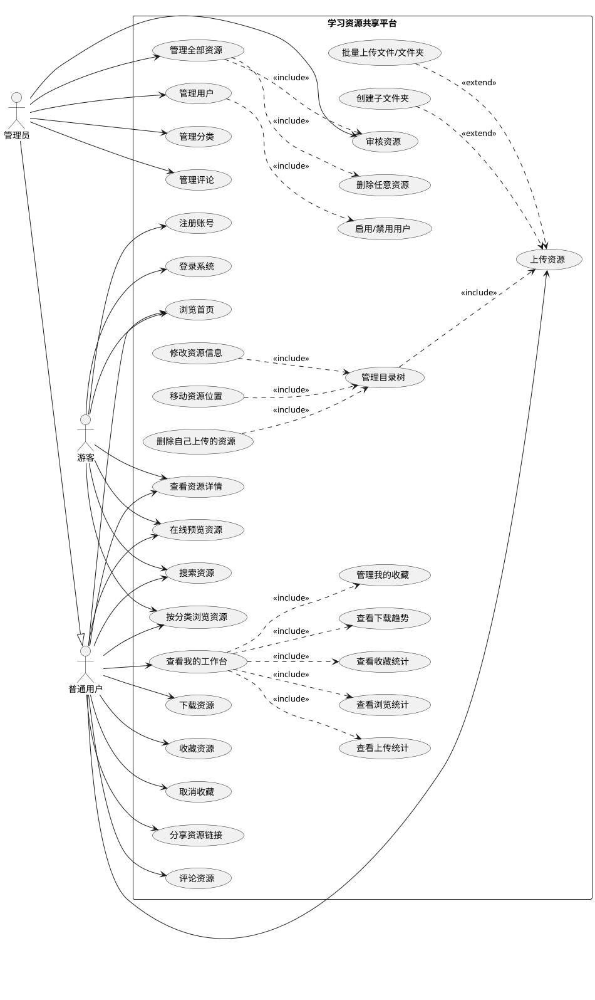
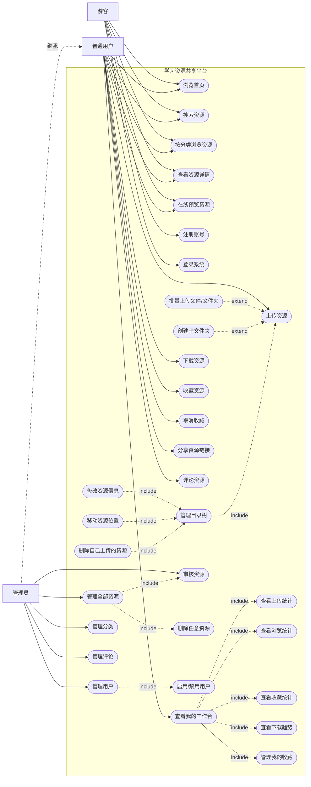

# 学习资源共享平台用例图

## PlantUML 标准版本

## Mermaid 预览版本

Mermaid 对 UML 用例图的支持在不同编辑器里不完全一致。下面使用 `flowchart` 近似表达同一组参与者和用例，适合在只支持 Mermaid 的 Markdown 环境中预览。

## 角色说明

| 角色 | 说明 |
| --- | --- |
| 游客 | 未登录用户，可以浏览、搜索、查看详情和在线预览公开资源，也可以注册或登录。 |
| 普通用户 | 登录后的用户，可以上传资源、管理自己上传的文件夹和目录树、收藏、评论、下载、分享资源，并查看个人统计工作台。 |
| 管理员 | 拥有普通用户能力，同时可以审核资源、管理全部资源、管理用户、管理分类和管理评论。 |

## 核心用例说明

| 用例 | 说明 |
| --- | --- |
| 上传资源 | 用户上传课程文件、教学视频、文档、图片等资源。 |
| 批量上传文件/文件夹 | 用户可以选择多个文件或整个文件夹上传，系统按目录结构聚合。 |
| 管理目录树 | 用户可以在可视化目录树中创建子文件夹、修改、移动、删除自己上传的文件或文件夹。 |
| 在线预览资源 | 系统支持常见文件类型预览，不支持预览的文件仅提供上传、下载和管理能力。 |
| 查看我的工作台 | 用户集中查看自己的上传、浏览、收藏、下载趋势等统计信息。 |
| 分享资源链接 | 用户可以在资源卡片或资源详情页复制/分享资源访问链接。 |
| 审核资源 | 管理员对用户上传的资源进行审核和状态管理。 |
| 管理全部资源 | 管理员可以查看、审核、删除平台内所有资源。 |
